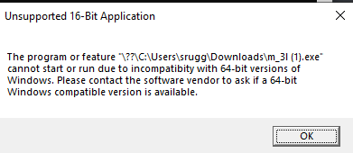
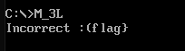
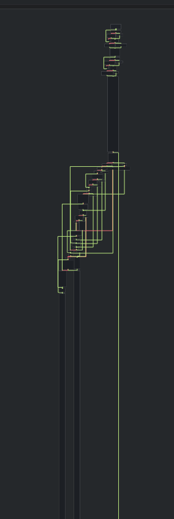

# Microsoft ❤ Linux
**Reverse Engineering (rev) - Easy**

Description:
```
Microsoft's latest addition to the world of Open Source: a flag checker...
```

# Table of Contents
1. [Discovery](#Discovery)
2. [So there's this thing called DOSBox](#DOSbox)
3. [This challenge is increasingly cursed](#Cursed)
4. [Live analysis](#Analysis)
5. [It's actually a babyrev, though](#babyrev)
6. [So what the hell is going on?](#splain)
8. [TL;DR](#tldr)

## Discovery <a name="Discovery"></a>

This challenge gave us an `.exe` file, let's try to run it:


Ah, *of course*, how foolish of me, we of course have to run it in a CLI:



"Unsupported 16-Bit Application"? Now I'm being screwed with. I figure that **I have two options:** I could either see where this 16 bit application could take me, or I could *be reasonable* and poke at it in linux to take a better look at it.

### **So there's this thing called DOSBox** <a name="DOSbox"></a>
So DOSBox is a quick and dirty emulator to get MS-DOS, a 16bit CLI operating system running on windows. I downloaded it, mounted a folder with the challenge and ran it:



So clearly, the program just takes in input, performs some check, then if it's the flag, tells me if its correct.

But how do I debug a 16 bit application in DOSbox? I did some searching around, but I really felt that any option was impractical, and going just a tad too far for what was presumably a babyrev challenge. I think at this point it's time to throw it into a disassembler.

## This challenge is increasingly cursed <a name="Cursed"></a>
So I did, much without thinking, throw it into my choice of a disassembler+decompiler: cutter, which is based on radare2. Assuming that the automatic features would figure it out, it took a very long time for it to disassemble, which was odd for a **1KB binary**, and then trying to browse the assembly graph, it would often crash cutter, because it was building an infinite length graph of nops, for whatever reason. Forcing cutter into 16 bit helped, but wasn't much better. "Ok, sure, cutter is a bit experimental, let me try Ghidra!"



*wtf cutter*

So in Ghidra, disassembling 64/32 bit style outputted not... "useful" results, and trying to disassemble 16 bit caused Ghidra to run into a Null Pointer exception. Around the same time, my teammate messaged saying he has the challenge working on linux:

```
m 3l.exe: ELF 32-bit LSB executable, Intel 80386, version 1 (SYSV), statically linked, no section header
```

So through some witchcraft, this binary is able to come off as a 32-bit ELF, but then is able to run on MS-DOS as a 16 bit application. We'll touch on this later, but for now, knowing that it works on linux, that's where I'll start.

## Live analysis <a name="Analysis"></a>
Since it was working on linux, I threw it into gdb, there's no main function, but disassembling from the start showed me the general gist of what I needed.

The linux side uses the old way of doing system interrupts, `int 0x80`, to call read rather than a `syscall`, meaning that's consistent with 32-bit executables, at least.

Stepping through the code, we can see that it starts a counter, loops through 18 times (`0x12`) and applies an operation on our input string, compares it with a static string in the binary:

```as
0x00100061      xor     esi, esi ; i=0
0x00100063      cmp     esi, 0x12  ; if(i==18)
0x00100066      je      0x10007f ;jump to exit conds
0x00100068      mov     al, byte [esi + 0x100111] ; input chr
0x0010006e      rol     al, 0xd ; roll chr by 13 places
0x00100071      mov     bl, byte [esi + 0x100210] ; flag chr
0x00100077      cmp     al, bl ; if(i_chr!=f_chr)
0x00100079      jne     0x100088 ; jump to incorrect exit
0x0010007b      inc     si ; ++i
0x0010007d      jmp     0x100063 ; continue loop
```

The operation in question is `rol al,0xd`, which shifts the first 8 bits of the rax register left by the immediate times, but if a bit were to shift past the end of the number, it rolls back to the start (Think your leetcode string rotations).

So, because the string was static, I could copy the character hex codes, convert them to binary, roll them right (using an online string rotater, incredible) 13 places, then I get the first half of the flag:

 `corctf{3mbr4c3,3xt`

***Finally!*** A rot13 cipher that actually *rotates* them 13 places.

So what about the other half? Well, more careful analysis shows that after it's done doing this to the first half of the string, it's always guaranteed to exit before reaching the 16-bit code. So I really have to figure this windows part out, don't I?

## It's actually a babyrev, though <a name="babyrev"></a>
So the disas on gdb doesn't look nice past the linux exit, since it's 16 bit, so it doesn't line up with standard x86 conventions. But, since I knew the second half was going to be 16-bit I was able to get a 16-bit disassembly from cutter: 

```as
0000:00d4      xor     si, si ; i = 0
0000:00d6      cmp     si, 0x12  ; if (i == 18) 
0000:00d9      je      0x1000ec ; jump to exit conds
0000:00db      mov     al, byte [si + 0x213] ;input char
0000:00df      xor     al, 0xd     ; xor input by 13
0000:00e1      mov     bl, byte [si + 0x322] ;flag char
0000:00e5      cmp     al, bl ; if (i_chr!=f_chr)
0000:00e7      jne     0x1000f2 ; jump to incorrect exit
0000:00e9      inc     si ; ++i
0000:00ea      jmp     0x1000d6 ; continue loop
```

So, the operation that's being applied to the second half of my input is a single byte xor. This can be easily reversed by just xor-ing again by `0xd`. ***Thank god*** for no DOS debugging!

Since I had the rest of the flag string saved, I applied the xor to each byte, which gave me the full and final flag:

`corctf{3mbr4c3,3xt3nd,3Xt1ngu15h!!1}`


## So what the hell is going on? <a name="splain"></a>

If I had to make a few educated guesses:

- There *is* an ELF magic in the binary, which makes Linux able to run it, which starts its instructions at the top of `entry()`, but the program is guaranteed to exit before it reaches any of the 16 bit sections.

- The COM file format, which is a simple binary format for MS-DOS, is completely static, and it's not supposed to move itself during execution. You can also tell it what instruction address to start at with the `[ORG 0xaddr]` header when writing code.

Meaning, this file runs on linux like a normal ELF, and then on MS-DOS, on start, jumps halfway through the existing x86 code, to the 16bit x86 and runs normally. Luckily, the operations applied on the string are simple enough to analyze and reverse through static analysis.

Thanks for my teammates who helped out with disassembly and figuring out what was going on.

## TL;DR <a name="tldr"></a>

The given binary is a smorgasbord 32bit ELF followed by a 16-bit COM(?) executable. The "encrypted" string is stored statically in the binary. The first half it it, each byte is "rolled" 13 bits to the left, and the second half, each byte is xored by 13.

The output flag is then: `corctf{3mbr4c3,3xt3nd,3Xt1ngu15h!!1}`